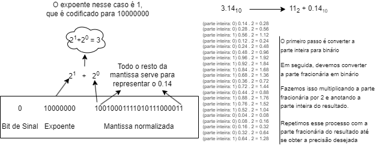

### Universidade Federal de Sergipe 
Interface Hardware Software
Turma 03

Gabriel Teixeira Silveira

### Relatório de tarefas da Aula 3

Professor:  
Calebe Micael de Oliveira Conceição

São Cristóvão 
Julho de 2024

## 1. Representação Binária do Float 3.14

Antes, é importante mencionar que o valor N que será guardado no registrador de 32 bits segue o padrão:

**N** = (-1)sinal x 1.fração x 2expoente

E o expoente é codificado seguindo o padrão:

0000 0000 &nbsp;&nbsp;&nbsp;"sub-normal" 
0000 0001 &nbsp;&nbsp;&nbsp;-126  
   ...  
0111 1110 &nbsp;&nbsp;&nbsp;-1  
0111 1110 &nbsp;&nbsp;&nbsp;-1  
0111 1110 &nbsp;&nbsp;&nbsp;-1  
   ...  
1111 1110 &nbsp;&nbsp;&nbsp; 127 
1111 1111 &nbsp;&nbsp;&nbsp;"not a number (NaN)"
 

Para isso, segui o passo a passo demonstrado abaixo. 

