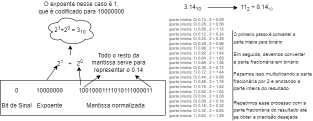

### Universidade Federal de Sergipe 
Interface Hardware Software
Turma 03

Gabriel Teixeira Silveira 
Curso: Ciência da Computação 
Matrícula: 202100011987

### Relatório de tarefas da Aula 3

Professor:  
Calebe Micael de Oliveira Conceição

São Cristóvão 
Julho de 2024

# 1. Representação Binária do Float 3.14

Antes, é importante mencionar que o valor N que será guardado no registrador de 32 bits segue o padrão:

**N** = (-1)sinal x 1.fração x 2expoente

E o expoente é codificado seguindo o padrão:

0000 0000 &nbsp;&nbsp;&nbsp;"sub-normal" 
0000 0001 &nbsp;&nbsp;&nbsp;-126  
   ...  
0111 1110 &nbsp;&nbsp;&nbsp;-1  
0111 1111 &nbsp;&nbsp;&nbsp; 0  
1000 0000 &nbsp;&nbsp;&nbsp; 1  
   ...  
1111 1110 &nbsp;&nbsp;&nbsp; 127 
1111 1111 &nbsp;&nbsp;&nbsp;"not a number (NaN)"

 
Para isso, segui o passo a passo demonstrado abaixo.

 

# 2. Estudo de Hierarquia de memória
## Memória Cache
Memória Cache são componentes que armazenam dados para que futuras solicitações sejam entregues mais rapidamente para a CPU. Os dados de um Cache costumam ser resultados de cálculos anteriores ou cópias de dados armazenado em memórias de acesso mais lento.
CPUs modernas possuem de 2 a 3 níveis de cache feitos de SRAM ***Static Random-Access Memory***.
<ul>
<li> Cache L1: Integrada na CPU, extremamente rápida e com pouquíssimo armazenamento (16 KB a 128 KB), leva de 1 a 5 clocks para calcular o endereço da memória e trazer o valor da L1.
<li> Cache L2: Maior que a L1 (128 KB e 1 MB), leva de 8 a 20 clocks para calcular o endereço da memória e trazer o valor da L2.
<li> Cache L3: Compartilhada entre os núcleos da CPU, maior (2 MB e 64 MB) e mais lenta que as caches L1 e L2. Leva de 30 a 80 clocks para calcular o endereço da memória e trazer o valor da L3.
</ul>

## Translation Look-aside Buffer (TLB)
Primeiramente, devemos abordar o que são paginações na memória de um sistema.

Uma **paginação** é um esquema de gerenciamento da memória de um computador, que divide a memória física e a memória virtual em blocos de tamanho fixo, chamados de ***Páginas***. As **páginas** são alocadas em ***Quadros (Frames)***, que são as unidades da memória física de tamanho correspondente ao tamanho da página.

Para saber em qual quadro cada página será alocada, é usada uma ***Tabela de Páginas***, que faz a tradução dos endereços virtuais para os físicos. Essa tabela é composta pelas páginas virtuais, pelos quadros e pela Entrada da Tabela de Páginas (***Page Table Entry - PTE***)

A PTE possui dois componentes, o **endereço físico** e os **bits de controle**
Temos 12 bits de controle, entre eles estão:
1. Bit de Presença (Valid/Present Bit): Indica se a página está atualmente na memória física.
4. Bit de Dirty (Dirty Bit): Indica se a página foi modificada.
2. Bits de Controle de Acesso (Read/Write/Exec Bits): Indica se a página é de leitura/escrita/executável.
3. Bit de Usuário/Supervisor (User/Supervisor Bit): Define o nível de privilégio necessário para acessar a página.

O ***Translation Look-aside Buffer (TLB)*** é um tipo de cache usada para guardar as traduções recentes da PTE, o **TLB** fica dentro da CPU e evita que seja necessário fazer dois acessos seguidos para se obter um dado, o primeiro para ler a PTE e o segundo para ler o dado.  
O **TLB** armazena as entradas mais recentes da PTE e é consultado antes da CPU buscar um endereço virtual. 
Caso a tradução não esteja no **TLB**, a PTE é consultada e o **TLB** armazena a tradução para futuros acessos.

<ul>
<li>  O cache TLB costuma ter entre 16 a 512 entradas da PTE;</li>
<li>  O tempo de acesso está entre 0.5 a 1 ciclo por hit;</li>
<li>  O custo por miss está entre 10 a 100;</li>
<li>  A chance de miss está entre 0.01% a 1%.</li>
</ul>

Fonte: PATTERSON David, HENNESSY John. Computer Organization and Design, Fifth Edition: The Hardware/Software Interface. Morgan Kaufmann Publishers Inc.340 Pine Street, Sixth FloorSan Francisco, CA, Estados Unidos. Página 438.

## Políticas de substituição e de proteção no sistema operacional

Para permitir que o sistema operacional implemente proteção no sistema de memória virtual, o hardware deve fornecer pelo menos três capacidades básicas:
1. Suporte a pelo menos dois modos que indicam se o processo em execução é um processo de usuário ou um processo do sistema operacional, variadamente chamado de processo supervisor, processo de kernel ou processo executivo.
2. Fornecer uma parte do estado do processador que um processo de usuário pode ler, mas não escrever. Isso inclui o bit de modo usuário/supervisor, que dita se o processador está em modo usuário ou supervisor, o ponteiro da tabela de páginas e a TLB. Para escrever esses elementos, o sistema operacional utiliza instruções especiais que estão disponíveis apenas no modo supervisor.
3. Fornecer mecanismos para o processador alterar entre modos usuário e supervisor. Geralmente isso é atingido com uma exceção de chamada de sistema, implementada como uma instrução especial (syscall no conjunto de instruções MIPS) que transfere o controle para um local dedicado no espaço de código do supervisor. Como em qualquer outra exceção, o contador de programa no ponto da chamada de sistema é salvo no PC de exceção (EPC), e o processador é colocado no modo supervisor. Para retornar ao modo usuário a partir da exceção, é necessário usar a instrução de retorno de exceção (***return from exception ERET***), que retorna ao modo usuário e salta para o endereço no EPC.

## Segmentação paginada

É um esquema de gerenciamento de memória que combina a segmentação e a paginação para fornecer uma forma de alocar e gerenciar a memória de diferentes processos em sistemas computacionais. 

#### Conceitos iniciais
***Segmento***: É uma porção de memória que pode variar em tamanho e é usado para armazenar diferentes tipos de dados ou código. Cada segmento tem um nome ou número e um comprimento.

***Tabela de Segmentos***: Cada processo tem uma tabela de segmentos que armazena a base (endereço inicial) e o limite (tamanho) de cada segmento.

***Quadros***: Unidades da memória física de tamanho correspondente ao tamanho da página.
#### Passos do Funcionamento:
1. ***Divisão em Segmentos***: A memória de um processo é dividida em segmentos lógicos, cada um representando uma entidade lógica, como uma função, array ou pilha.

2. ***Divisão em Páginas***: Cada segmento é dividido em páginas de tamanho fixo.

3. ***Criação da Tabela de Segmentos***: Cada processo tem uma tabela de segmentos que armazena a base e o limite de cada segmento. A base aqui aponta para a tabela de páginas do segmento.

4. ***Tabela de Páginas por Segmento***: Cada segmento tem sua própria tabela de páginas que mapeia páginas virtuais para quadros de memória física.

Fonte: https://www.youtube.com/watch?v=8S-WhoQ3psI&t=354s

#### Exemplo de funcionamento:
Na imagem acima, à direita, temos os segmentos 0, 1 e 2. Esses números são equivalentes aos índices da ***tabela de segmento***.  
Por sua vez, a ***tabela de segmento*** contém os índices dos ***quadros (frames)*** onde ficam as ***tabelas de páginas*** de cada segmento. 
A ***tabela de páginas*** contém os ***quadros*** da memória física que cada ***página*** se encontra alocada.

## Extensão de Endereço Virtual para 57 bits (5 níveis)

A extensão do tamanho de páginas virtuais para ***57 bits***, endereços físicos de memória de 52 bits e o uso de 5 níveis de tabelas de páginas (***PML5***) são evoluções no esquema de paginação que vêm sendo utilizada em alguns processadores x86-64. 
Esses processadores, na empresa AMD são identificados pelo CPUID Fn0000_0007_ECX[LA57] 
Esta extensão amplia significativamente o espaço de endereçamento virtual, permitindo endereçar um volume muito maior de memória. 
Com 57 bits de número de página virtual, o espaço de endereço virtual se expande para até 128 PB (petabytes), em comparação com os 256 TB (terabytes) proporcionados pelos 48 bits e quatro níveis de paginação (PML4).

Essa extensão no tamanho das páginas virtuais se deve ao aumento do número de aplicações que necessitam de grandes quantidades de memória nos últimos tempos, aplicações de machine learning, big data, simuladores, máquinas virtuais, computação de alto desempenho e muitas outras são beneficiadas com o aumento do endereçamento virtual.

